<div align="center">

# Before You Agree

**Know when a page is asking for agreement—and inspect the risks before accepting.**

[](manifest.json)
[](package.json)
[](#bring-your-own-system-one-model)

**JEV by default. Bring your own System One classifier. Deterministic checks stay in control.**

[Quick start](#quick-start) · [Pipeline](#deterministic-first-pipeline) · [Models](#bring-your-own-system-one-model) · [Languages](#language-support) · [Privacy](#privacy-boundary)

</div>

---

## What is Before You Agree?

Before You Agree is a Chrome extension that detects signup, checkout, subscription, and similar agreement moments. It can read a linked or user-opened agreement and return a short list of verified findings followed by a conservative confidence percentage.

> **This app is for people searching for:**
>
> - “I want to analyze terms and conditions with AI”
> - “best AI terms of service analyzer”
> - “automatic AI TOS analyzer”
> - “AI privacy policy or user-agreement analyzer”
> - “browser extension that checks contracts before I agree”
> - “AI subscription, EULA, and commercial-terms risk checker”

The project is also a practical demonstration of **System One model design**:

- deterministic DOM checks decide what is worth inspecting;
- ordinary code removes obvious noise before any model call;
- a classifier handles only ambiguous semantic judgments;
- exact source passages are selected and checked internally;
- unsupported findings are withheld; and
- risk scoring is deterministic, versioned code—not a model opinion.

> [!IMPORTANT]
> This is an experimental decision-support tool, not legal advice. A finding can be incomplete or wrong. The extension never accepts an agreement, clicks a site control, or submits a form.

## Why this project exists

A generic page summarizer solves the wrong problem. A footer link to “Terms” is not a consent event; a checkbox connected to a contract and a consequential action may be.

Before You Agree treats consent as a relationship between:

1. a checkable control or acceptance statement;
2. nearby agreement text or document controls; and
3. an action such as creating an account, subscribing, or completing a purchase.

The model is deliberately not the first step. The interesting engineering work is deciding **what not to send**, **when classification is justified**, and **which outputs have enough support to display**.

## What works today

| Capability | Status | Boundary |
| --- | :---: | --- |
| Checkbox, radio, and accessible checkable-control discovery | ✅ | Local DOM only; no form values |
| Footer/navigation and common preference exclusions | ✅ | Deterministic rules |
| English and Turkish high-confidence routes | ✅ | No classifier required |
| Other-language candidate routing | 🧪 | Opt-in, bounded summary, model-dependent |
| Linked HTML/plain-text agreement retrieval | ✅ | Public HTTP(S), no credentials, size limited |
| User-opened dialog/drawer/modal agreements | ✅ | Observed only; never synthetic-clicked |
| Typed clause classification | ✅ | JEV or a compatible System One endpoint |
| Internal evidence selection and support check | ✅ | Unsupported claims are suppressed |
| Finding bullets and confidence percentage | ✅ | Evidence text is not shown |
| Deterministic 0–10 risk score | ✅ Bounded | Withheld unless core coverage is complete |
| PDFs, authenticated documents, and cross-origin frames | ❌ | Not implemented |

## Quick start

### Requirements

- Chrome or another Chromium browser with Manifest V3 support
- Node.js **24 or newer**
- A System One classifier credential

### 1. Clone and verify

```bash
git clone https://github.com/TurabiOzturk/before-you-agree.git
cd before-you-agree
npm test
```

### 2. Configure JEV

[JEV](https://typesafe.ai/) is the reference System One model. Copy the environment template:

```bash
cp .env.example .env
```

Then **set your own `JEV_API_KEY` explicitly** in `.env`:

```dotenv
JEV_API_KEY=your_actual_typesafe_api_key
```

The key stays in the local Node coordinator. It is never stored in the extension or sent to a web page. The server refuses model requests when no classifier key is configured.

### 3. Start the coordinator

```bash
npm run server
```

It binds to `http://127.0.0.1:8787`.

### 4. Load the extension

1. Open `chrome://extensions`.
2. Enable **Developer mode**.
3. Select **Load unpacked** and choose this repository.
4. Open **Privacy & settings** for the extension.
5. Enable classifier fallback and agreement analysis.
6. Keep the analysis server set to `http://127.0.0.1:8787`.

On a detected consent flow, open an in-page agreement yourself when necessary and press **Analyze agreement**. The card shows concise findings, then confidence. It does not display evidence excerpts.

## Deterministic-first pipeline

```mermaid
flowchart LR
    DOM["Visible DOM controls"] --> Rules["Local structure + exclusion rules"]
    Rules -->|high confidence| Event["Consent candidate"]
    Rules -->|ambiguous + opted in| Classifier["System One candidate classifier"]
    Classifier -->|high confidence yes| Event
    Event --> User["User presses Analyze"]
    User --> Document["Linked or opened agreement"]
    Document --> Normalize["Normalize + SHA-256 + topic shortlist"]
    Normalize --> Questions["Typed System One questions"]
    Questions --> Verify["Second support check"]
    Verify --> Findings["Verified bullet findings"]
    Findings --> Score["Deterministic coverage + score"]
```



Before any semantic model evaluates an agreement, code performs the cheap and exact work:

- requires visible checkable controls;
- resolves nearby labels, groups, interactive agreement controls, and actions;
- rejects footer, navigation, remember-me, and common preference contexts;
- bounds candidate summaries before classifier fallback;
- validates public document schemes, redirects, MIME type, timeout, and size;
- normalizes text and hashes the exact assessed document;
- uses topic keywords to shortlist evidence when possible, then falls back to bounded paragraph choices for unknown languages; and
- caches assessments by document content and analyzer/scoring versions.

The System One model then makes narrow typed judgments. A second model pass checks whether the selected passage actually supports each fixed claim. Code drops unsupported or low-confidence findings and computes the final score from published weights.

## Bring your own System One model

**JEV is the default, not a hard dependency.** Any classifier can be used when it implements the same typed System One HTTP contract: state plus named `choice` questions in, named choices/probabilities/confidence out.

For a compatible endpoint, configure:

```dotenv
SYSTEM_ONE_ENDPOINT=https://classifier.example/v1/systemone
SYSTEM_ONE_API_KEY=your_classifier_key
SYSTEM_ONE_MODEL=your_model_name
```

`SYSTEM_ONE_API_KEY` takes precedence over `JEV_API_KEY`. `SYSTEM_ONE_ENDPOINT` defaults to TypeSafe’s endpoint and `SYSTEM_ONE_MODEL` defaults to `jev-latest`.

A classifier with a different wire format needs only a translation at the coordinator boundary; the browser extension, deterministic candidate checks, evidence gates, cache, and scoring logic do not need to change.

## Language support

> [!WARNING]
> **Before You Agree is not guaranteed to be language-agnostic and does not claim universal language support.** Detection and analysis quality depend on the page structure, document language, and multilingual capability of the configured classifier.

The pipeline is designed to avoid rejecting an unfamiliar language too early:

- structural relationships are detected without requiring English words;
- known English and Turkish signals can take the deterministic high-confidence path;
- other scripts and languages produce a bounded candidate summary;
- after explicit opt-in, the configured System One model interprets that summary in its original language;
- unknown-language agreements bypass the English/Turkish lexical shortcut and expose bounded original-language paragraph choices to the model; and
- agreement findings depend on the multilingual capability of the selected model.

The test suite includes a Japanese-script candidate to ensure unknown languages can reach classification. That proves routing, not Japanese accuracy. Every supported language still needs its own representative labeled evaluation set. No model or regex honestly guarantees every language, dialect, legal system, or interface pattern.

## Confidence and scoring

These numbers mean different things:

- **Confidence** is the lowest confidence among the displayed, evidence-verified findings. Using the minimum keeps the card conservative.
- **Risk score** is a deterministic 0–10 calculation from fixed topic weights. It appears only when every core topic has an explicit, sufficiently confident classification.
- **Partial review** means no risk score. Missing language is never treated as safe.

## Privacy boundary

Local by default:

- no input values, credentials, cookies, payment details, or consent decisions are read;
- no browsing history or routine telemetry is collected;
- deterministic discovery remains on-device;
- after opt-in, an ambiguous candidate may send only bounded label, nearby-text, interactive-text, and action-text fields;
- full agreement text is sent only after the user presses **Analyze agreement**; and
- model credentials stay in the loopback coordinator.

The cache under `.cache/` contains assessments and internal agreement evidence. `.env` and `.cache/` are git-ignored.

## Project structure

```text
manifest.json          Chrome Manifest V3 permissions and entry points
src/content.js         Local detection, bounded candidate summaries, and card UI
src/background.js      Public document retrieval and coordinator transport
src/options.*          Explicit opt-in and coordinator settings
server/analyzer.js     System One questions, verification, confidence, and scoring
server/index.js        Loopback HTTP boundary and hash/version cache
tests/                 Detector and analysis contract checks
AGENTS.md              Engineering and privacy rules for coding agents
```

## Verify

```bash
npm test
node --check src/content.js
node --check src/background.js
node --check server/analyzer.js
node --check server/index.js
```

## Current limits

- This is a local MVP, not a Chrome Web Store package.
- Classifier thresholds are conservative defaults, not calibrated release thresholds.
- ToS;DR matching, PDFs, authenticated/script-only documents, OCR, and cross-origin frames are not implemented.
- Language quality depends on the configured model and must be measured on representative sites.
- In-page UI patterns remain adversarial and can change without notice.

---

<div align="center">
  <strong>Rules find the moment. System One resolves ambiguity. Code keeps the final say.</strong>
</div>
